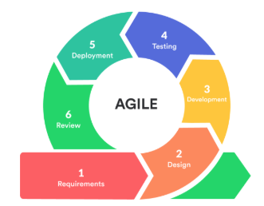

# Software Development Life Cycle
_SDLC(Software Development Life Cycle) is a structured process to develop a software, It includes some phases which we need to follow to develop the software in a effective way with better performance and quality. Those Phases are:_

1. 📋 **Planning:** *In this phase team will define the project scope, objective, resources and initail analysis with stake holders.*
2. 📝 **Requirement Analysis:** *In this phase the team will collect the document needs from users and stake holders.*
3. 🎨 **Design:** *In this phase the team will convert the requirements to technical requirements.*
4. 💻 **Development:** *In this phase the developers will write the code for the software as per the requirements.*
5. 🐛 **Testing:** *In this phase team will test the software for any bugs or defects.*
6. 🚀 **Deployment:** *In this phase team will deploy the application to servers in to different environments.*
7. 🔧 **Maintainance:** *In this phase team will take care of application health, security updates etc.,*

**There are some models developed using this phases those are:**
1. _**Waterfall Methodology**_
2. _**Agile Methodology**_
3. _**DevOps Methodology**_

**_Let’s Dive Deeper into this methods:_**

### Waterfall Methodology
*This approach follows a strict sequential order, development advances to the next phase only after completing the current one.*

**Disadvantages of this Methodology are :**
- Resources remain underutilized as subsequent phase teams idle until prior work finishes.
- Errors in early phases demand restarting from the beginning, demanding perfection upfront.
- Testing occurs only after full code development, risking major bugs and tensions between development and testing teams.
- Client rejection of the final product can lead to project failure or full redevelopment.

### Agile Methodology
*This approach follows sprint based development, software is divided into features and this features are developed and tested one after other in each sprint. and every sprint follows the core SDLC elements.*

**Advantages**
- Parallel development and testing reduce bugs compared to Waterfall.
- Clients see progress regularly, adding/changing features via the backlog.

**Disadvantages**
- Frequent changes can expand requirements endlessly without strict control.
- Requires constant collaboration, daily standups, and skilled cross-functional teams.

  

### DevOps Methodology
*In this approach the developers will develop the code and the testers will test the code on the same day and if there are any fixes the developers get feedback and this process will continue in the whole development process. to acheive this we take the help of the CI/CD pipelines and some other tools.*

**Advantages**
- Faster Releases with improved performance and efficiency
- Better Collaboration between teams.
- Cost Effective by automating the most of the tasks.

**Continuous Integration (CI):** _In Continuous Integration as soon as developers commit the code the pipeline will clone the code, then compiles the code, will test the code and build the code into package._

**Continuous Delivery (CD):** _In Continuous Delivery as soon as the package is created the pipeline will fetch the package and deploy it into the servers but there should be manual approval to deploy the_ application.

**Continuous Deployment (CD):** _In Continuous Deployment as soon as package is created the pipeline fetches the package and will deploy into the servers automatically and there is no need of any approval._
